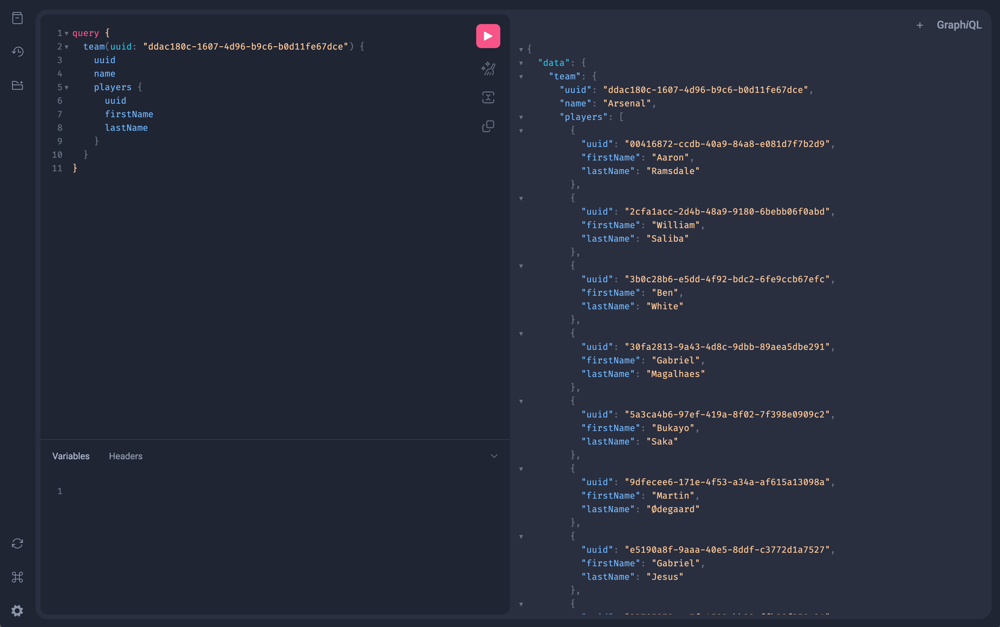

# Django GraphQL

A project to illustrate how to build a GraphQL API with Django. Created as part
of a talk I gave at [Django London](https://www.meetup.com/djangolondon/).



## Running locally

Create a copy of .env file, it should work as is:

```
cp .env.example .env
```

Run:

```
docker compose up --watch
```

Migrate tables:

```
docker compose exec api python manage.py migrate
```

Load data so you have something to work with:

```
docker compose exec api python manage.py loaddata /code/league/fixtures/teams.json
docker compose exec api python manage.py loaddata /code/league/fixtures/players.json
docker compose exec api python manage.py loaddata /code/league/fixtures/matches.json
```

Create your django admin user:

```
docker compose exec api python manage.py createsuperuser
```

View admin:

```
localhost:8000/admin
```

View GraphiQL UI:

```
localhost:8000/graphql
```

## Example queries

Fetch all teams:

```
query {
  teams {
    uuid
    name
  }
}
```

A specific team with players:

```
query {
  team(uuid: "ddac180c-1607-4d96-b9c6-b0d11fe67dce") {
    uuid
    name
    players {
      uuid
      firstName
      lastName
    }
  }
}
```

Fetch all matches:

```
query {
  matches {
    homeTeam {
      name
    }
    awayTeam {
      name
    }
    matchDate
    homeScore
    awayScore
  }
}
```

Create a team:

```
mutation {
  createTeam(name: "Django FC") {
    team {
      name
      createdAt
    }
  }
}
```

Update a player:

```
mutation {
  updatePlayer(uuid: "619dd84f-4bea-40c3-b323-8e10a2b3a0bb", jerseyNumber: 8) {
    player {
      uuid
      firstName
      lastName
      jerseyNumber
    }
  }
}
```

Delete a player:

```
mutation {
  deletePlayer(uuid: "e5190a8f-9aaa-40e5-8ddf-c3772d1a7527") {
    success
  }
}
```
